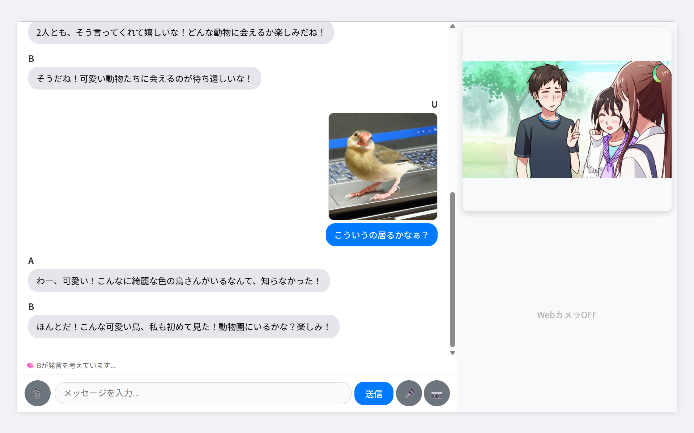

# ai-chat

マルチモーダルなAIチャット


- AI複数話者 & 対話コントロール
- 状況に応じた画像出力
- 画像添付/Webカメラ対応
- 音声認識 / 音声合成

## デモ動画

- [マルチAI対話](https://youtu.be/xGwAYrVz54M)
- [webカメラ](https://youtu.be/IxRt3SGqczc)
- [全自動AIモード](https://youtu.be/4KFjETokM2A)

## フォルダ構成

```
.
├── config.yaml: 設定ファイル
├── run.py: ランナー
├── main.py: CLI
├── server.py: バックエンド
├── frontend/: フロントエンド
├── src/: ソースコード一式
├── .env.sample: 環境変数サンプル
├── pyproject.toml
└── uv.lock
```

## 環境構築

- `uv sync`
    - pythonと[uv](https://github.com/astral-sh/uv)インストール済みであることが前提
- LLM
    - [Gemini](https://aistudio.google.com/apikey): APIキーを取得し、.envに`GOOGLE_API_KEY`を設定する
    - [Openrouter](https://openrouter.ai/): APIキーを取得し、.envに`OPENROUTER_API_KEY`を設定する
    - [Ollama](https://ollama.com/): `ollama run gemma3`などで使うモデルをインストール
- 音声合成を使う場合（使うものを選択してインストール）
    - [VOICEVOX](https://voicevox.hiroshiba.jp/)をインストール
    - [COEIROINK](https://coeiroink.com/download)をインストール
    - [AivisSpeech](https://aivis-project.com/)をインストール
- 音声認識を使う場合
    - [VOSK Models](https://alphacephei.com/vosk/models)から`vosk-model-ja-0.22`をDLして展開
        - `uv sync --extra windows` (Windowsのみ)
    - whisperを使う場合は設定不要（初回に自動ダウンロードされます）
    - geminiを使う場合は前述のAPIキーの設定のみ
- 画像生成を使う場合
    - [Gemini](https://aistudio.google.com/apikey): APIキーを取得し、.envに`GOOGLE_API_KEY`を設定する
    - [FastSD CPU](https://github.com/rupeshs/fastsdcpu): FastSD側の`./start-webserver.bat`/`./start-webserver.sh`でAPIサーバーを立てておく
- `config.yaml`を環境に合わせる
    - LLMモデルの確認
    - 合成したいキャラクターのIDを確認
        - VOICEVOX: `uv run python run.py tts-list voicevox`（VOICEVOX GUI起動後）
        - COEIROINK: `uv run python run.py tts-list coeiroink`（COEIROINK GUI起動後）
        - AivisSpeech: `uv run python run.py tts-list aivisspeech`（AivisSpeech GUI起動後）
    - voskモデルへのパスを確認
- 画像入力: 画像添付/Webカメラを使う場合は、LLMがvision対応している必要があります

### Windows対応

- uv sync時のbuildエラー
    - visual studio build tools 2022でC++によるデスクトップ開発（MSVC、Windows11 SDK、CMake）をインストールしてからリトライ

## 使い方

音声合成を使う場合、裏でGUIを起動しておく

### CLI

```sh
uv run python run.py chat
```

### GUI

```sh
uv run python run.py server
```

http://localhost:5000/ へアクセス

# フォーマット

```sh
uv run ruff format
uv run ruff check --fix
npx prettier --write .
```
